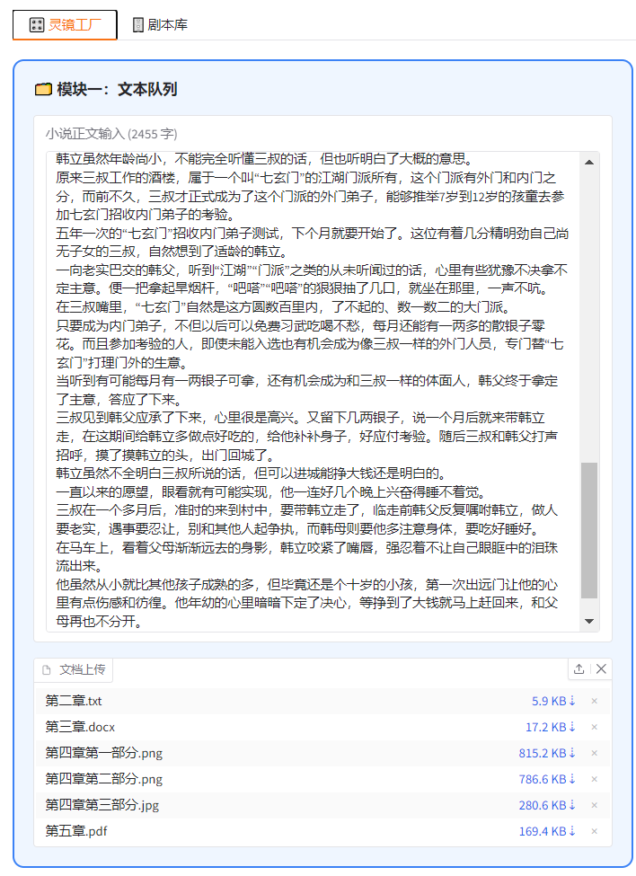
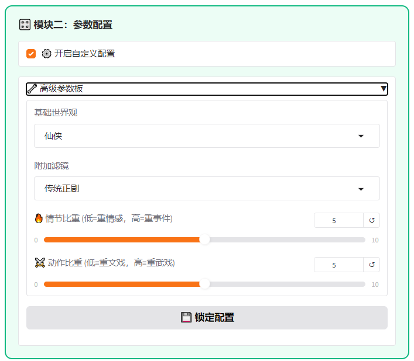
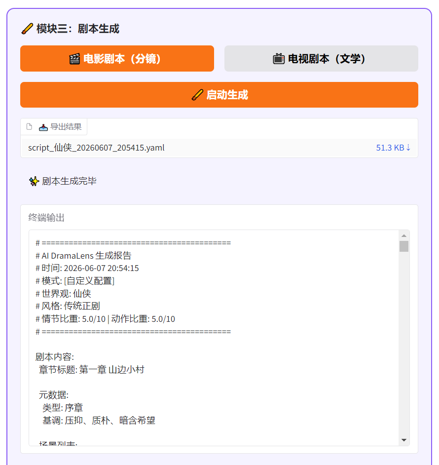
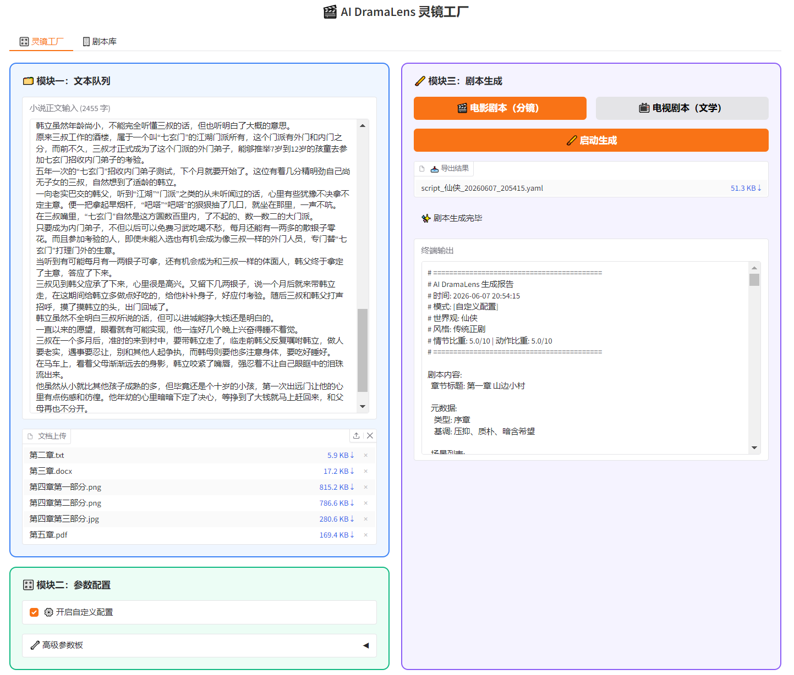
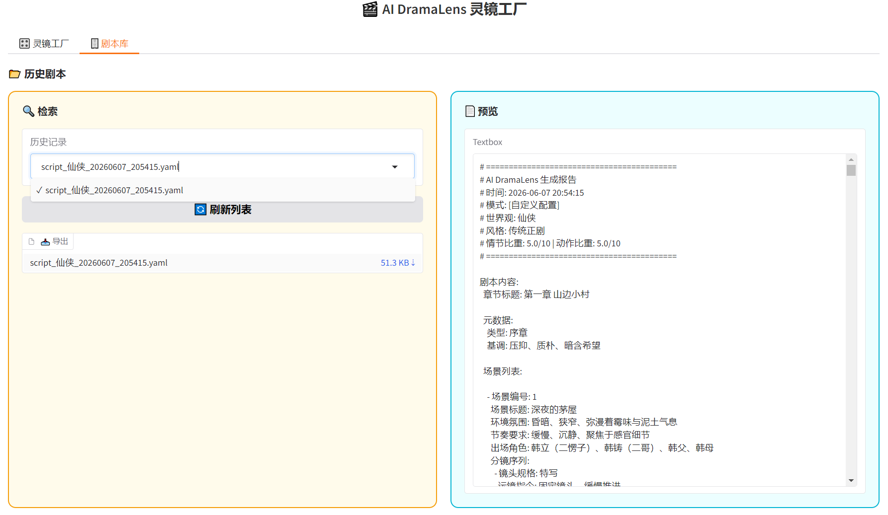

# 🎬 AI DramaLens 灵镜工厂 - 小说转剧本智能工具

## 0. 项目文件结构
本项目采用标准化的 Python 工程结构，核心代码与文档分布如下：

```text
AI_DramaLens/
├── app.py                 # 项目主入口，Gradio 前端界面与流程调度
├── omni_parser.py         # 多模态文档解析器（支持 TXT/DOCX/PDF/图片OCR）
├── smart_sorter.py        # 智能语义排序算法（处理乱序文本拼接）
├── writer_agent.py        # 剧本生成核心引擎（并发调用大模型）
├── prompt_lib.py          # 动态提示词工程库（世界观、风格、参数量化）
├── docs/                  # 📄 文档目录
│   ├── YAML_Schema.md     # 🌟 核心交付物：剧本 YAML Schema 定义与设计说明 (Markdown版)
│   └── YAML_Schema.txt    # 🌟 核心交付物：剧本 YAML Schema 定义与设计说明 (纯文本版)
├── image/                 # README 展示配图目录
├── requirements.txt       # 项目依赖清单
├── .env.example           # 环境变量配置模板（API Key）
└── .gitignore             # Git 忽略清单


## 1. 项目简介
本项目是一款面向小说作者与影视从业者的 AI 辅助剧本创作工具。旨在打破传统小说改编剧本的高门槛，通过构建一条“小说原本多模态解析 -> 智能语义排序 -> 动态提示词工程 -> 并发切片生成”的完整流水线，将非结构化的小说长文本，全自动转换为高度结构化、极具可编辑性的 YAML 格式剧本初稿。

本项目不仅支持电影分镜与电视剧文学剧本双模式输出，还内置了智能侦测与高度自定义的参数面板，为创作者提供从文本输入到剧本导出的全周期一站式解决方案。

## 2. Demo 视频演示
> **[演示视频链接]**：https://www.bilibili.com/video/BV1PTEh6yE6j/?vd_source=c2d5118f96e671b06ffa90b85693baee

## 3. 核心功能特性

| 功能模块 | 功能详细描述 | 界面展示 (截图) |
| :--- | :--- | :--- |
| **🗂️ 多模态文本队列** | **双轨输入**：支持直接在文本框输入小说正文（自带实时字数统计），同时支持批量上传 `.txt`, `.docx`, `.pdf` 甚至 `.jpg/.png` 图片格式。底层接入视觉大模型进行精准 OCR 提取。 |  |
| **🧩 智能语义排序** | **乱序熔接**：针对用户上传的无序文件或图片残页，系统通过提取首尾语义特征，利用大模型进行逻辑拼图，自动恢复正确的章节顺序并无缝拼接。 |  |
| **🎛️ 双轨参数配置** | **智能侦测 vs 自定义**：懒人用户可直接使用“智能侦测”，AI 自动阅读文本并匹配世界观与风格；专业用户可开启“高级参数板”，手动选择 15 种世界观、5 种滤镜，并精准调节“情节比重”与“动作比重”滑块。 |  |
| **🖌️ 双模式剧本生成** | **电影/电视双轨输出**：<br>1. **电影剧本(分镜)**：输出包含镜头规格、运镜、光影、音效的纯物理视觉指令。<br>2. **电视剧本(文学)**：输出包含动作、台词、OS(内心独白)的时间轴序列。 |  |
| **📥 实时预览与导出** | **结构化交付**：生成完毕后，终端直观展示 YAML 源码。剧本头部自动附带生成时间、模式、参数等元数据报告，并提供 `.yaml` 格式源文件一键下载，方便后期二次打磨。 |  |
| **🗄️ 剧本库与历史记录** | **全周期管理**：系统自动将每次生成的剧本持久化保存至本地。用户可在“剧本库”标签页中通过下拉菜单随时检索、预览历史剧本，并支持重新导出。 |  |

## 4. 依赖说明与原创声明
根据考核要求，本项目引用的第三方库及原创功能说明如下：

### 4.1 引用的第三方库/框架
*   **Gradio**：用于构建前端交互界面（UI 布局、组件状态管理）。
*   **OpenAI (Python SDK)**：用于调用 DeepSeek (文本处理) 和 Qwen (视觉处理) 的大模型 API。
*   **PyMuPDF (fitz)**：用于解析和提取 PDF 文档中的文本。
*   **python-docx**：用于解析 Word (DOCX) 文档。
*   **python-dotenv**：用于加载本地 `.env` 环境变量，保护 API Key 安全。

### 4.2 原创功能部分
除上述基础框架外，本项目的核心业务逻辑与架构均为自主原创开发，主要包括：
1.  **多模态路由解析器 (`omni_parser.py`)**：原创的文件分发逻辑与并发解析流程。
2.  **智能语义排序算法 (`smart_sorter.py`)**：原创的“首尾特征提取+大模型拼图”算法，解决乱序文本的物理熔接问题。
3.  **剧本生成引擎 (`writer_agent.py`)**：原创的并发切片生成逻辑，以及针对电影/电视双模式的 YAML Schema 结构设计（实现视听解耦与时序解耦）。
4.  **动态提示词工程 (`prompt_lib.py`)**：原创的“情节比重”与“动作比重”量化算法，将前端滑块数值转化为精准的 AI 行为约束指令。
5.  **前端深度定制 (`app.py`)**：通过注入自定义 CSS，解决了 Gradio 原生组件在复杂交互下的布局崩塌问题。

## 5. 运行指南
1. 安装依赖：`pip install -r requirements.txt`
2. 配置环境：复制 `.env.example` 为 `.env`，并填入真实的 API Key。
3. 启动程序：`python app.py`


